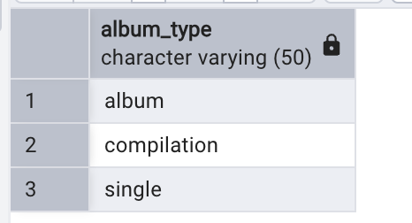
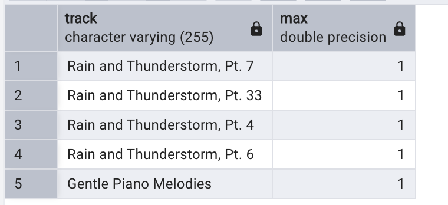
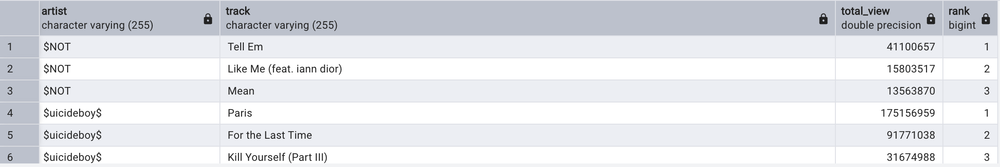
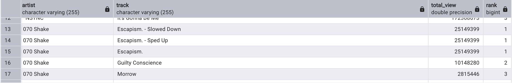
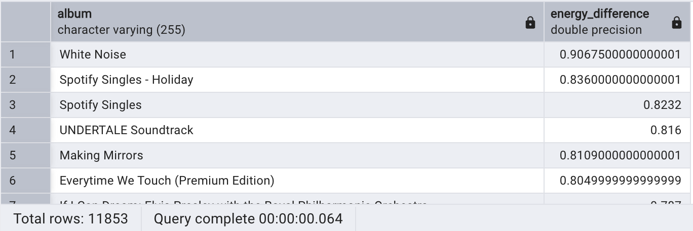

  

<h1 align="left"> 🎵 Spotify SQL Analysis Project</h1>

  A SQL-based data analysis project on 20,000+ Spotify and Youtube tracks to uncover artist performance, track features, and streaming insights with PostgreSQL. 

---

## 📂 Dataset Overview

- **Rows:** 20,594 tracks  
- **Source:** Already cleaned dataset with fields from Spotify and YouTube  
- **Key Fields:**
  - `artist`, `track`, `album`, `album_type`
  - Audio features: `danceability`, `energy`, `valence`, `tempo`, `acousticness`, etc.
  - YouTube stats: `views`, `likes`, `comments`
  - Spotify `streams`
  - Boolean fields: `licensed`, `official_video`
  - Platform: `most_played_on` (Spotify or YouTube)

 ---
## 🛠️ Tools Used

- **SQL Dialect:** PostgreSQL  
- **Environment:** pgAdmin / psql  
- **Language:** SQL only  
- *(No Python, BI tools, or dashboards used — SQL-only project)*

---

## 🔍 Exploratory Data Analysis (EDA)

Key statistics:
- Unique Artists: 2,074  
- Unique Albums: 11,854  
- Platform Breakdown: Spotify & YouTube  
- Data Cleaning: Removed tracks with `duration = 0`

---

## 📌 Business Questions Answered

| # | Question |
|--:|----------|
| 1 | Which tracks have more than 1 billion streams? |
| 2 | Show all albums and their respective artists |
| 3 | Total comments on licensed tracks |
| 4 | List all tracks from albums of type “single” |
| 5 | Number of tracks per artist |
| 6 | Average danceability per album |
| 7 | Top 5 tracks with highest energy |
| 8 | Track views and likes where official_video is TRUE |
| 9 | Total views per album |
|10 | Tracks streamed more on Spotify than YouTube |
|11 | Top 3 most viewed tracks per artist (using window functions) |
|12 | Tracks with above-average liveness |
|13 | Difference in max and min energy per album (using CTE) |

---

## 🧠 SQL Concepts Used

- **GROUP BY**, **ORDER BY**, **LIMIT**
- **Aggregate functions**: `AVG`, `SUM`, `MAX`, `MIN`
- **Boolean filtering** (`official_video = TRUE`)
- **Common Table Expressions (CTEs)**
- **Window Functions** (`DENSE_RANK() OVER(PARTITION BY ...)`)
- **Subqueries** and `COALESCE()` for conditional logic

---
## 🖼️ Screenshots
|  |  |

|  |  |

|  |
---

## 💡 Key Insights

- Over **380+ tracks** have more than 1B Spotify streams  
- Official YouTube videos tend to have higher engagement (likes/comments)
- Some tracks are **streamed more on Spotify than viewed on YouTube**, which may influence marketing decisions
- Top artists include recurring names with consistent performance across multiple platforms

---

